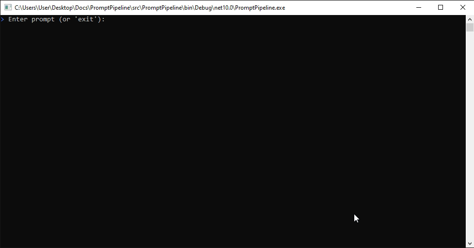
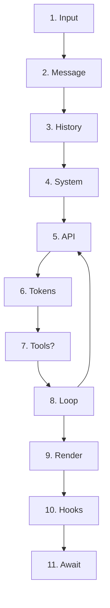

## PromptPipeline

> A CLI AI agent where execution flows through a pipeline of custom middlewares

### Demo:



### Design Principles:

- **Composable** → easily add or remove features
- **Extensible** → build plugins and custom behaviors
- **Transparent** → full visibility into each step  
- **Testable** → isolate and validate every middleware

### Some middleware examples

- Track execution time
- Capture and log final output cleanly
- Navigate codebases
- Generate Excel reports
- Enforce security rules
- Integrate with APIs (GitHub, DB, etc.)
- Allow community plugins

### Example of a flow



#### 1. Input

- User types a message or pipes input
- Example: 
Find all TODO comments in src/ and create a summary

#### 2. Message

- Builds a message object with role, content blocks, and any attachments.

```json
{
  "role": "user",
  "content": [
    {
      "type": "text",
      "text": "Find all TODO..."
    }
  ]
}
```

#### 3. History

- Message gets pushed onto the in-memory conversation array
- The conversation history is just an array that grows over the session. It's what the context window manager trims later.

```
[user] Set up the project structure
[assistant] I'll create the directory layout...
[user] Now add the database models
[user] Find all TODO comments... NEW
```

#### 4. System

- Merges project instructions (AIDefinitions.md), available tool definitions, directory context, and any persistent memory into one system prompt.

#### 5. API

- Stream with AI API

```
data: {"type":"content_block_delta","delta":{"text":"I'll"}}
data: {"type":"content_block_delta","delta":{"text":" search"}}
data: {"type":"content_block_delta","delta":{"text":" for"}}
data: {"type":"content_block_delta","delta":{"text":" TODOs"}}
data: {"type":"content_block_delta","delta":{"text":" in"}}
data: {"type":"content_block_delta","delta":{"text":" src/"}}
```

#### 6. Tokens

- Parse tokens as they arrive, render to the terminal live

```
I'll search for `TODO` comments in **src/**
```

#### 7. Tools?

- If a tool is detected, execute/call tool
- The response can contain tool calls. Each gets resolved, permission-checked, and run. Multiple tools can execute in parallel.

```
I'll search for TODO comments...
Let me use the bash tool to find them.
tool_use:
    name: "bash"
    input: "grep -r TODO src/"

Permission check: allowed (pre-approved pattern)
```

#### 8. Loop

- Collect tool results, append to history, call the API again
- Tool outputs become new messages in the conversation. The API gets called again with updated history. This is the agentic loop.

```
$ grep -r "TODO" src/
src/query.ts:42: // TODO: add retry logic
src/tools.ts:108: // TODO: validate input
... 14 more results
↻ Loop back to API (Iteration 2)
```

#### 9. Render

- Render the final response

```
TODO Summary
Found **16 TODO comments** across the codebase:
- `src/query.ts:42` — Add retry logic
- `src/tools.ts:108` — Validate input
- `src/context.ts:15` — Cache system prompt
```

#### 10. Hooks

- After the response is done: trim the conversation if it's getting long, extract anything worth remembering

#### 11. Await

- Back to the REPL(Read-Eval-Print Loop), waiting for the next message
- The loop idles until user input. Ctrl+C is handled gracefully without losing conversation history.

```
terminal
$
```

### Tools

#### 📁 File Operations

Tools for reading, writing, and manipulating files.

| Tool           | Description                                         |
| -------------- | --------------------------------------------------- |
| `FileRead`     | Read contents of a file                             |
| `FileEdit`     | Modify existing file content                        |
| `FileWrite`    | Create or overwrite files                           |
| `Glob`         | Match file paths using patterns                     |
| `Grep`         | Search for text patterns in files                   |
| `NotebookEdit` | Edit notebook-style files (e.g., Jupyter notebooks) |

##### FileRead

Read the contents of a file from the filesystem

How It Works: Reads files with line-range support. Handles both text and binary files, with automatic encoding detection. Respects .gitignore and permission boundaries.

Parameters:
- filePath
- startLine?
- endLine?

##### FileEdit

Make targeted edits to existing files using search and replace

How It Works: Uses exact string matching to locate edit targets. Requires unique match — fails if the search string appears multiple times. Supports multi-line replacements.

Parameters:
- filePath
- oldString
- newString

##### FileWrite

Create new files or overwrite existing ones

How It Works: Creates parent directories automatically if they don't exist. Writes the complete file content — not a patch. Used for new files or complete rewrites.

Parameters:
- filePath
- content

##### Glob

Find files matching a glob pattern across the project

How It Works: Searches the workspace using glob patterns (e.g., **/*.ts). Respects .gitignore and returns matching file paths.

Parameters:
- pattern
- path?

##### Grep

Search file contents using regular expressions

How It Works: Performs regex search across files in the workspace. Returns matching lines with file paths and line numbers. Supports case-insensitive and include/exclude patterns.

Parameters:
- pattern
- path?
- include?

##### NotebookEdit

Replace, insert, or delete Jupyter notebook cells

How It Works: Operates on .ipynb files at the cell level. edit_mode can be replace (default), insert, or delete. Notebook metadata and output state for unmodified cells are kept intact.

Parameters:
- notebookPath
- cellIndex
- action
- content?


#### ⚙️ Execution

Run commands and execute code in different environments.

| Tool         | Description                                       |
| ------------ | ------------------------------------------------- |
| `Bash`       | Execute shell commands                            |
| `PowerShell` | Run PowerShell scripts                            |
| `REPL`       | Execute code interactively (Read-Eval-Print Loop) |

##### Bash

Execute shell commands in the user's terminal with safety analysis

How It Works: Runs commands through a safety analyzer that detects destructive operations (rm -rf, git push --force). Commands run in the user's shell environment with full access to installed tools.

Parameters:
- command
- timeout?

##### PowerShell

Execute PowerShell commands on Windows systems

How It Works: Windows-specific execution environment. Runs PowerShell scripts and commands with the same safety analysis as Bash. Handles PowerShell-specific syntax and modules.

Parameters:
- command
- timeout?

##### REPL

Run code in an interactive REPL session (Python, Node, etc.)

How It Works: Maintains a persistent REPL session that preserves state between calls. Variables, imports, and definitions persist across invocations within the same session.

Parameters:
- language
- code

#### 🌐 Search & Fetch

Retrieve and search for information.

| Tool         | Description                          |
| ------------ | ------------------------------------ |
| `WebFetch`   | Fetch raw content from a URL         |
| `WebSearch`  | Perform search engine queries        |
| `ToolSearch` | Discover and explore available tools |

##### WebFetch

Fetch a URL and process it with an AI model

How It Works: Takes a URL and a prompt. Fetches the page, converts HTML to markdown, then runs the prompt against the content using a small, fast model. Returns the model's response.

Parameters:
- url
- prompt

##### WebSearch

Search the web and return results

How It Works: Queries a search engine and returns structured results with titles, URLs, and snippets. Used when this AI CLI tool needs current information not in its training data.

Parameters:
- query
- maxResults?

##### ToolSearch

Search for available MCP tools by name or description

How It Works: Searches the registry of available tools (both built-in and MCP) by name or description. Returns matching tools with their schemas. Used for tool discovery at runtime.

Parameters:
- query

#### 🤖 Agents & Tasks

Core primitives for building multi-agent workflows and task systems.

| Tool          | Description                  |
| ------------- | ---------------------------- |
| `Agent`       | Create or manage an agent    |
| `SendMessage` | Send messages between agents |
| `TaskCreate`  | Create a new task            |
| `TaskGet`     | Retrieve task details        |
| `TaskList`    | List all tasks               |
| `TaskUpdate`  | Update an existing task      |
| `TaskStop`    | Stop or terminate a task     |
| `TeamCreate`  | Create a team of agents      |
| `TeamDelete`  | Delete a team of agents      |

##### Agent

Spawn a sub-agent to handle complex tasks autonomously

How It Works: Creates an independent AI CLI tool instance with its own context window. The sub-agent can use tools, read files, and execute commands. Results are returned to the parent when complete.

Parameters:
- prompt
- tools?
- model?

##### SendMessage

Send messages between agents in multi-agent orchestration

How It Works: Inter-process communication between AI CLI tool Code sessions via Unix domain sockets. Agents and background daemons on the same codebase can coordinate through this.

Parameters:
- target
- message

##### TaskCreate

Create a new task in the task list

How It Works: Spawns a task that runs in its own execution context. Tasks can be monitored, updated, or stopped.

Parameters:
- prompt
- taskId?

##### TaskGet

Get a task by ID from the task list

How It Works: Retrieves a task's current state and output by its ID.

Parameters:
- taskId

##### TaskList

List all tasks in the task list

How It Works: Returns an overview of all tasks in the current session with their IDs, statuses, and creation times.

##### TaskUpdate

Update a task in the task list

How It Works: Modifies a task's configuration or adds context.

Parameters:
- taskId
- update

##### TaskStop

Stop a running background task

How It Works: Gracefully terminates a background task. Any partial output generated before stopping is kept. The task's final state is marked as stopped.

Parameters:
- taskId

##### TeamCreate

Create a team of agents with defined roles and capabilities

How It Works: Sets up a multi-agent team with a lead coordinator and specialized workers. Each member gets a defined role and agent type.

Parameters:
- roles
- configuration

##### TeamDelete

Remove a team and clean up its resources

How It Works: Tears down a multi-agent team, stopping all member agents and cleaning up scratch directories. Collects final outputs before deletion.

Parameters:
- teamId

#### 🧭 Planning

Enable structured planning and execution flows.

| Tool            | Description                         |
| --------------- | ----------------------------------- |
| `EnterPlanMode` | Switch the agent into planning mode |
| `ExitPlanMode`  | Exit planning mode                  |
| `EnterWorktree` | Start an isolated execution context |
| `ExitWorktree`  | End the execution context           |

##### EnterPlanMode

Switch to plan mode — outline steps before executing

How It Works: Activates a structured planning phase where AI CLI tool outlines steps before taking action. Prevents premature execution on complex tasks that need architectural thinking first.

##### ExitPlanMode

Prompt the user to exit plan mode and start coding

How It Works: Signals that the plan is written and ready for user review. Does not take the plan as a parameter — it reads from the plan file. Only for code implementation tasks, not research.

##### EnterWorktree

Create or enter an isolated git worktree for safe experimentation

How It Works: Creates a git worktree — a separate working directory linked to the same repo. Changes here don't affect the main branch.

Parameters:
- branchName?

##### ExitWorktree

Exit the current worktree and return to the main branch

How It Works: Leaves the worktree and returns to the original working directory. Can optionally merge changes back or discard them entirely.

Parameters:
- merge?

#### 🔌 MCP

Model Context Protocol tools for integrating external systems.

| Tool               | Description                           |
| ------------------ | ------------------------------------- |
| `mcp`              | Interact with MCP-compatible services |
| `ListMcpResources` | List available MCP resources          |
| `ReadMcpResource`  | Read data from an MCP resource        |
| `McpAuth`          | Handle MCP authentication             |

##### mcp

Invoke a tool from a connected MCP (Model Context Protocol) server

How It Works: Generic wrapper for MCP tools — name and schema are dynamically overridden per invocation. Routes tool calls through the MCP protocol, handling serialization, auth, and error mapping.

Parameters:
- serverName
- toolName
- arguments

##### ListMcpResources

List available resources from connected MCP servers

How It Works: Queries connected MCP servers for their available resources (files, databases, APIs). Returns URIs and descriptions that can be read with ReadMcpResource.

Parameters:
- serverName?

##### ReadMcpResource

Read data from a specific MCP resource

How It Works: Fetches content from an MCP resource URI. Resources can be files, database records, API responses, or any data the MCP server exposes. Returns structured content.

Parameters:
- uri

##### McpAuth

Authenticate with an MCP server using OAuth or tokens

How It Works: Handles authentication flows for MCP servers that require credentials. Supports OAuth 2.0 authorization code flow, token-based auth, and credential storage.

Parameters:
- serverName
- authType

#### 🖥️ System

General system utilities and interaction helpers.

| Tool              | Description                     |
| ----------------- | ------------------------------- |
| `AskUserQuestion` | Prompt the user for input       |
| `TodoWrite`       | Manage structured TODO lists    |
| `Skill`           | Execute predefined capabilities |
| `Config`          | Manage configuration settings   |

##### AskUserQuestion

Prompt the user for input or confirmation

How It Works: Presents a question to the user and waits for a response. Used for disambiguation, confirmation of destructive actions, or gathering information AI CLI tool can't infer.

Parameters:
- question
- options?

##### TodoWrite

Create and manage a persistent to-do list file

How It Works: Writes a structured TODO list to a file that persists across sessions. Each item has an ID, status (not-started, in-progress, completed), and description. Used for task tracking.

Parameters:
- items

##### Skill

Load and execute a specialized skill module

How It Works: Reads a SKILL.md file that contains domain-specific instructions, workflows, and constraints. Skills modify AI CLI tool's behavior for specialized tasks like testing or debugging.

Parameters:
- skillPath

##### Config

Read and update AI CLI tool Code configuration settings

How It Works: Accesses the AI CLI tool Code settings system. Can read current values, update preferences, and manage project-level or global configuration files.

Parameters:
- key
- value?
- scope?

### Command Catalog

#### ⚙️ Setup & Config

| Command           | Description                                   |
| ----------------- | --------------------------------------------- |
| `/init`           | Initialize AI Tool Cli Code in the current project |
| `/login`          | Authenticate your account                     |
| `/logout`         | Log out of your account                       |
| `/config`         | Manage configuration settings                 |
| `/permissions`    | Configure tool and system permissions         |
| `/model`          | Select or change the AI model                 |
| `/theme`          | Customize UI theme                            |
| `/terminal-setup` | Configure terminal integration                |
| `/doctor`         | Diagnose environment issues                   |
| `/onboarding`     | Start onboarding flow                         |
| `/mcp`            | Manage MCP (Model Context Protocol) settings  |
| `/hooks`          | Configure lifecycle hooks                     |

#### 🚀 Daily Workflow

| Command               | Description                     |
| --------------------- | ------------------------------- |
| `/compact`            | Compact conversation context    |
| `/memory`             | View or manage memory           |
| `/context`            | Inspect current context         |
| `/plan`               | Generate a structured plan      |
| `/resume`             | Resume previous session         |
| `/session`            | Manage active session           |
| `/files`              | List or inspect files           |
| `/add-dir`            | Add a directory to context      |
| `/copy`               | Copy output or data             |
| `/export`             | Export session or results       |
| `/summary`            | Summarize current work          |
| `/clear`              | Clear session/context           |
| `/brief`              | Generate a concise output       |
| `/color`              | Adjust output colors            |
| `/vim`                | Enable Vim mode                 |
| `/keybindings`        | Customize keybindings           |
| `/skills`             | Manage skills                   |
| `/tasks`              | Manage tasks                    |
| `/agents`             | Manage agents                   |
| `/fast`               | Switch to faster execution mode |
| `/effort`             | Adjust reasoning effort         |
| `/extra-usage`        | View extended usage             |
| `/rate-limit-options` | Configure rate limits           |

#### 🔍 Code Review & Git

| Command            | Description               |
| ------------------ | ------------------------- |
| `/review`          | Review code changes       |
| `/commit`          | Create a commit           |
| `/commit-push-pr`  | Commit, push, and open PR |
| `/diff`            | Show differences          |
| `/pr_comments`     | View PR comments          |
| `/branch`          | Manage branches           |
| `/issue`           | Manage issues             |
| `/security-review` | Run security analysis     |
| `/share`           | Share project or results  |
| `/tag`             | Tag releases or commits   |

#### 🐛 Debugging & Diagnostics

| Command            | Description                   |
| ------------------ | ----------------------------- |
| `/status`          | Show system status            |
| `/stats`           | Display usage statistics      |
| `/cost`            | Show cost breakdown           |
| `/usage`           | Show usage metrics            |
| `/version`         | Display version info          |
| `/feedback`        | Send feedback                 |
| `/think-back`      | Inspect reasoning steps       |
| `/thinkback-play`  | Replay reasoning              |
| `/rewind`          | Rewind session state          |
| `/ctx_viz`         | Visualize context             |
| `/debug-tool-call` | Debug tool execution          |
| `/perf-issue`      | Diagnose performance issues   |
| `/heapdump`        | Capture memory snapshot       |
| `/ant-trace`       | Trace execution flow          |
| `/env`             | Inspect environment variables |

### Tech:

- [spectre.console](https://github.com/spectreconsole/spectre.console)
- Console App (.NET)