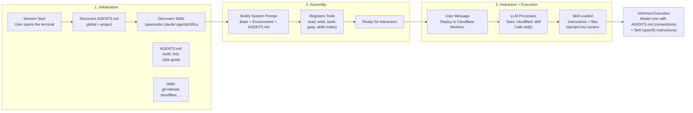
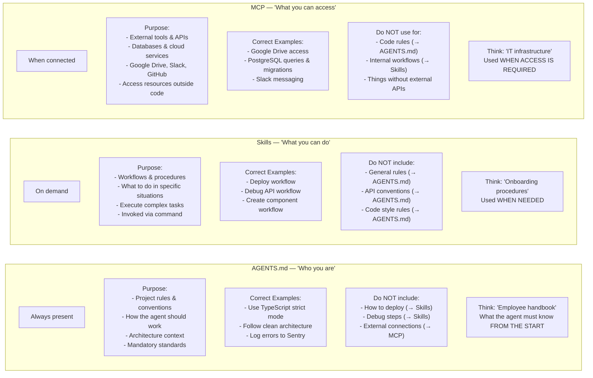

# AI-First-Dev

AI-first development is a paradigm where artificial intelligence is the core driver of the software lifecycle, rather than an afterthought, placing AI agents at the center of planning, coding, and testing

## TO DO

- Explain Spec Driven Development
- Apply Spec Driven Development in run-aspnetcore-microservices project

  
Agent in action

## Agent in action

This is a simplified summary based on tests performed with GitHub Copilot in VS Code.

### Overview

Copilot first discovers what it can use (green box on image): Agent, Instructions, Slash commands, Skill, Hook Discovery.

Then applies that to your request (red box on image): "I want to remove the delete endpoint in SubscriptionController".

Then the step-by-step child actions (blue box in the image) represent what the agent does after receiving your request: executing the workflow, searching for files, reading them, deciding what to change, and implementing those changes.

### Communication with AI models

Each request sends a payload in 4 sections:

* System → instructions, rules, and environment setup
* Input messages → conversation history, context, files, etc.
* Tools → definitions of functions/actions the model can call
* User request → the current prompt

Each request returns a response in 2 sections:

* Response
* Reasoning

    

### First request to AI model

    

- chat:claude-haiku-4.5 · claude-haiku-4.5 · success · 2,942ms
- Input tokens: 21,294
- Output tokens: 148
- Total tokens: 21,442

#### System

* Defines the AI as **GitHub Copilot** using **Claude Haiku 4.5**, acting as an expert coding assistant in VS Code.
* Must follow strict rules: obey user instructions, avoid harmful/copyrighted content, keep responses short and impersonal.
* Emphasizes **action over suggestion**: proactively read files, run tools, and implement changes until the task is fully complete.
* Encourages **efficient workflow**: gather context quickly, parallelize reads/searches, and track multi-step tasks with a todo system.
* Provides detailed **tool usage guidelines** (file ops, search, terminal, notebooks, browser).
* Enforces **concise communication style** with minimal explanations unless necessary.
* Includes **memory system** (user, session, repo) for storing useful insights.
* Introduces **skills system**: must load relevant `SKILL.md` files before acting when applicable.
* Supports **subagents** (e.g., Explore) for codebase analysis.

#### Input messages

* Environment: Windows, working in a **monorepo (Nx + NestJS)** project called *fakeflix*.
* Workspace contains multiple apps (`billing-api`, `monolith`) and domain packages (`billing`, `content`, `identity`, `recommendations`, etc.).
* Tools available include running tasks (e.g., `npm build`) and file editing/search.
* No stored memory (user, session, or repo).
* Instructions emphasize efficient file edits, batching changes, and using relevant skills when applicable.
* **User goal:** remove the *delete endpoint* from `SubscriptionController`.

#### Tools

* Defines a large set of **tools for interacting with a VS Code workspace** (files, search, terminal, browser, notebooks, etc.).
* Covers **file operations** (create, read, edit, search, replace) and **code navigation** (grep, semantic search, symbol usage/rename).
* Includes **execution tools** (run tasks, terminal commands, notebooks).
* Provides **project/setup utilities** (workspace creation, extensions, VS Code API docs).
* Adds **browser automation tools** (open, click, navigate, scrape pages).
* Supports **task management** (`manage_todo_list`) and **memory system** for persistence.
* Emphasizes **efficient workflows**: batch edits, avoid redundant operations, and use the right tool for each scenario.

#### User request

* Environment: Windows, working in a **large Nx + NestJS monorepo** (`fakeflix`) with multiple apps and domain packages.
* Workspace includes services like `billing`, `content`, `identity`, `recommendations`, plus shared modules and docs.
* A build task (`npm build` → `nest build`) is available.
* No stored memory (user, session, repo).
* Instructions stress **precise file edits**, including enough context, and **batching multiple edits efficiently**.
* Must check and load relevant **skills (SKILL.md)** before acting when applicable.
* **User goal:** remove the `DELETE` endpoint from `SubscriptionController`.

### First response from AI model

* Assistant plans to remove the delete endpoint from `SubscriptionController`.
* Starts by **searching the workspace** for the controller file using a file search tool.

### Loop

From this point, the process becomes a loop: the VS Code agent and AI model repeatedly use tools (e.g., search, read, edit via MCP) to gather context and apply changes until the task is fully completed.

#### Example of iterations in the Loop

* I asked for "SubscriptionController"
* Local MCP call file_search for "query": "**/SubscriptionController*" resulted on "No files found"
* Another call to AI model used extra 21,004 tokens just to inform tool_result was "No files found"
* AI response was to call MCP grep_search
* After next local MCP call grep_search works, it informs AI model the full path of the 3 matches
* AI respond that found "...subscription.controller.ts" and ask to make a local call read_file between lines 1 and 100
* etc

#### Example of memory in section Input messages

The orchestrator (agent/runtime) rebuilds the input context each time
It may include previous tool outputs, messages, or state explicitly.

* OS: Windows
* Workspace: `fakeflix` monorepo (NestJS + Nx style)
* Project structure: modular domains (`billing`, `content`, `identity`, etc.)
* Task available: `npm run build` (Nest build)
* Memory state:
* User memory: empty
* Session memory: empty
* Repo memory: empty
* Instructions:
* Use tools to find/edit code
* Include context when editing files
* Prefer batch edits
* Don’t create extra docs
* Check for skills if relevant
* User request:
* Remove **delete endpoint** from `SubscriptionController`
* Execution flow:
* `file_search` → no results
* `grep_search` → found file
* File location:
* `package/billing/http/rest/controller/subscription.controller.ts`
* Key observation:
* First search failed (too strict), second worked (broader search)

#### Agent plays a critical role

The agent plays a critical role because it acts as the “orchestrator” that gives structure and meaning to the AI model’s input. Instead of the model receiving a raw user request in isolation, the agent enriches it with context—like workspace details, available tools, prior steps, and instructions—so the model can make informed decisions

  
AGENTS.md, RULES, SKILLS and MCPs

## AGENTS.md

**Problem:** AI agent doesn’t know your project. AI agent needs different kinds of information: what is the build command? What is the style guide? How do you run an individual test? Which architectural patterns should be followed?

**Solution:** Create a “README for machines.” That’s what AGENTS.md (Markdown file) is about—and the entire ecosystem of Agent Skills that is emerging around it. 

The core principle: be concise and practical. No long texts explaining the project’s philosophy. The agent needs clear rules and executable commands.

AGENTS.md is an emerging, ecosystem-agnostic convention for documenting projects for AI agents, but it is not an official standard. Some tools—like Claude Code—use their own formats (e.g., CLAUDE.md) as the primary source of instructions

In a monorepo, global rules are typically defined at the root, with more specific or overriding rules defined within each package.

Each tool (e.g., Cursor, Claude Code) defines its own rules for prioritizing and discovering instruction files (such as "AGENTS.md", "CLAUDE.md", etc.). These tools may also automatically include those files in the agent’s context for new sessions, but the behavior is tool-specific and not standardized

## Rules

Rules are the content. AGENTS.md is the container.

Rules are individual behavioral instructions. They can live anywhere: system prompt, config files, inline instructions or inside AGENTS.md

## SKILL.md

AGENTS.md is the project’s manual, while Agent Skills are modular, on-demand behaviors. A Skill is a directory with a SKILL.md file containing specialized instructions—typically organized with sections like “What I do” and “When to use me.”

### Progressive Disclosure in AI Agent Skill Design

Progressive Disclosure keeps prompts small and efficient, avoids wasting tokens on unused information and scales well for large projects and many skills.

- Layer 1 (Indexing) is always present and lightweight. It tells the agent what Agent Skill exist without loading full details.
- Layer 2 (Activation) loads detailed instructions only when the AI model calls skill.
- Layer 3 (Reference) Only if AI model calls skill, it loads deeper resources (files, examples, scripts).

## MCP

MCP (Model Context Protocol) is an open-source standard for connecting AI applications to external systems.

Using MCP, AI applications like Claude or ChatGPT can connect to data sources (e.g. local files, databases), tools (e.g. search engines, calculators) and workflows (e.g. specialized prompts)—enabling them to access key information and perform tasks.

Think of MCP like a USB-C port for AI applications. Just as USB-C provides a standardized way to connect electronic devices, MCP provides a standardized way to connect AI applications to external systems.

## AGENT, SKILLS and MCP

  
Spec Driven Development

## Spec Driven Development

  

  
Monorepo

## Monorepo

Monorepo-style development is a software development approach where:

- You develop multiple projects in the same repository.
- The projects can depend on each other, so they can share code.
- When you make a change, you do not rebuild or retest every project in the monorepo. Instead, you only rebuild and retest the projects that can be affected by your change.

### Suggestion:

Use Nx. Smart Monorepo Build System & CI

### Risks:

#### Repository governance risk:

Without proper code ownership and review policies, other teams may modify code without the owning team’s awareness.

**Solution:** Use CODEOWNERS in GitHub. It automatically assigns reviewers (individuals or teams) based on matching rules for directories, files, or extensions. With branch protection enabled, pull requests can’t be merged without approval from the designated owners.

#### Big Ball of Mud:

When multiple projects share a monorepo without clear boundaries, the codebase can quickly become a Big Ball of Mud—a tangled, hard-to-understand system where dependencies are unclear, changes feel risky, and overall maintainability declines

**Solution:** In .NET (C#), split modules into separate projects (assemblies) to enforce boundaries, define clear namespaces per module, and mark implementation types as `internal` by default so they are inaccessible outside the module. Complement this with architectural tests to automatically detect and prevent boundary violations.

#### Codebase is too big for AI

A common concern is that AI coding agents can't handle monorepos because there's too much code, too many projects, too much context

**Solution:** Configure Tasks with well-defined scopes and constrained context, ensuring the agent operates only within a specific module or set of relevant files instead of the entire codebase

#### Large-scale changes

Changes on a shared library will affect all the applications that depend on it.

**Solution:** In .NET, publish shared code as versioned nuget packages and require consumers to opt into upgrades rather than inheriting changes automatically. Also, CI pipelines should run cross-project tests and impact analysis to detect breaking changes early

## Disclaimer

This is a simplified summary. This repository may contain errors, inaccuracies, or incomplete information.

## References:

- [AGENTS.md](https://agents.md/)
- [AGENTS.md and Agent Skills](https://www.techleads.club/c/blog/agents-md-e-agent-skills-por-debaixo-dos-panos-dos-ai-coding-agents)
- [MCP](https://modelcontextprotocol.io/docs/getting-started/intro)
- [nx.dev](https://nx.dev/docs/getting-started/intro)
- [monorepo](https://nx.dev/blog/monorepo-is-not-monolith#misconceptions)
- [CODEOWNERS](https://docs.github.com/en/repositories/managing-your-repositorys-settings-and-features/customizing-your-repository/about-code-owners)
- [Enterprise Spec Driven Development](https://www.infoq.com/articles/enterprise-spec-driven-development/)
- [run-aspnetcore-microservices](https://github.com/aspnetrun/run-aspnetcore-microservices)