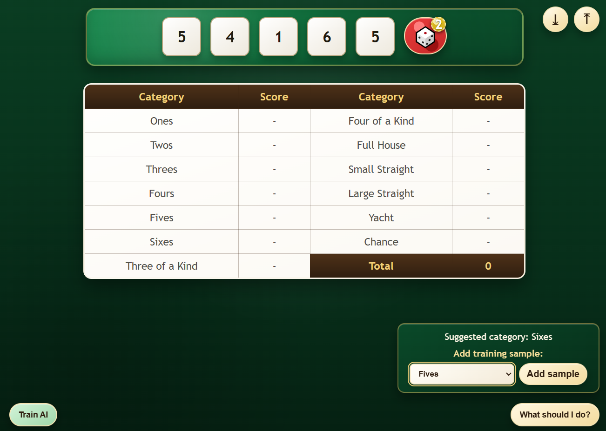

# 🎲 Yacht AI – Browser-Based Game with TensorFlow.js

A simple **Yacht (Yahtzee-style) dice game** built using only:

- React
- TensorFlow.js (running entirely inside the browser)
- Save data sample and AI model in local storage
- Upload and download data sample

