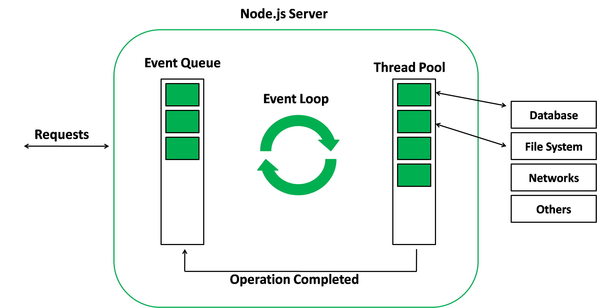
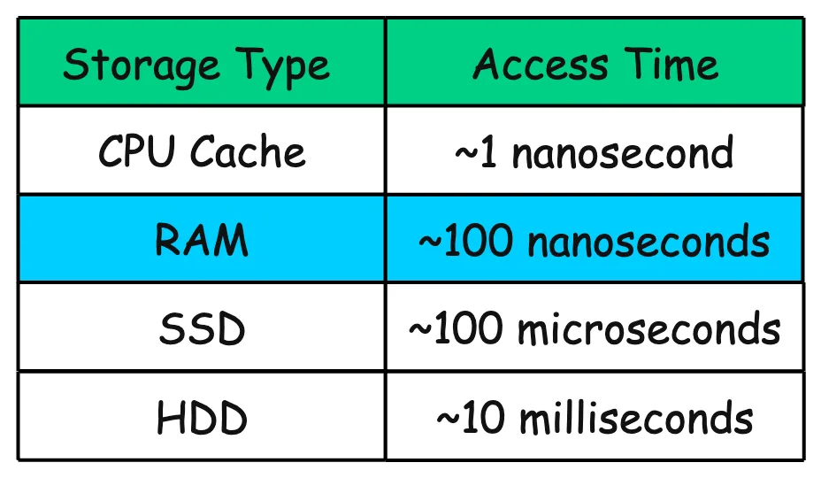
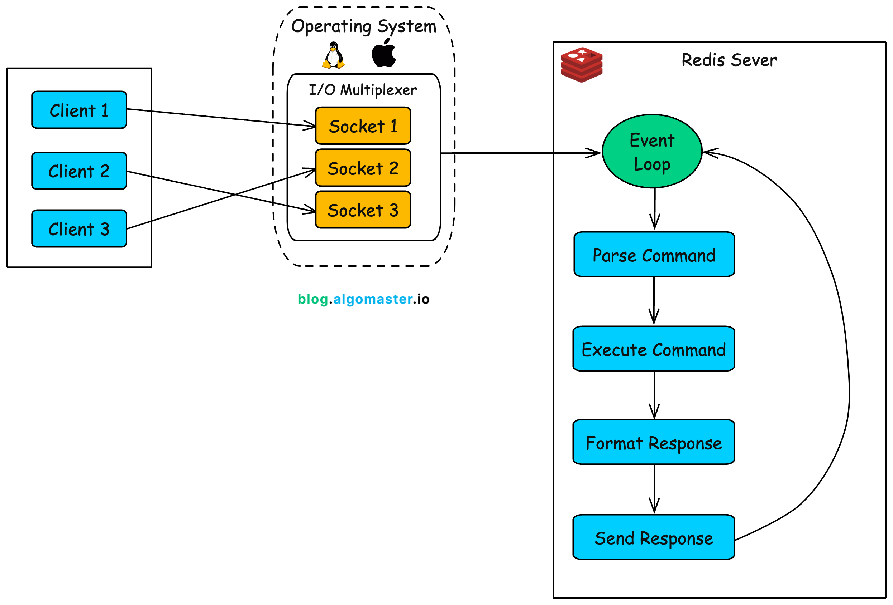
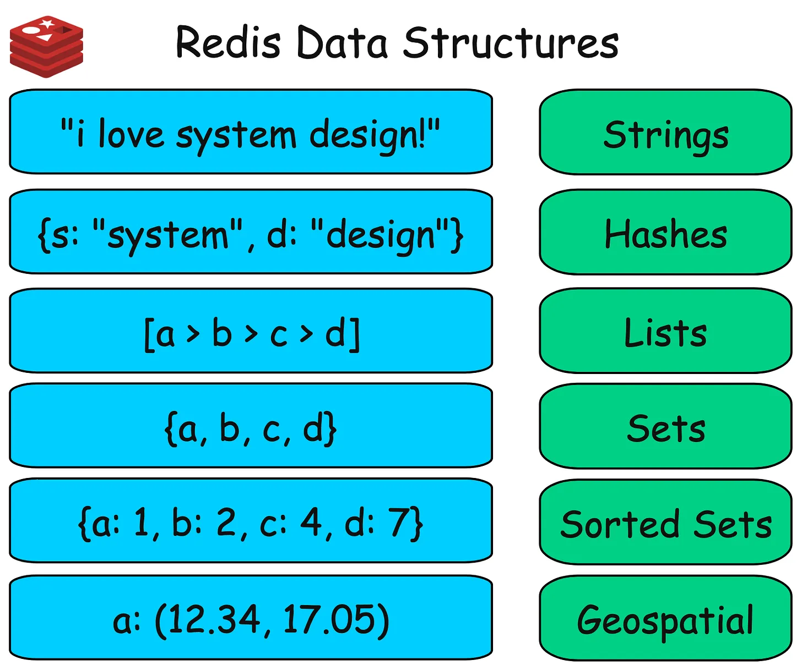
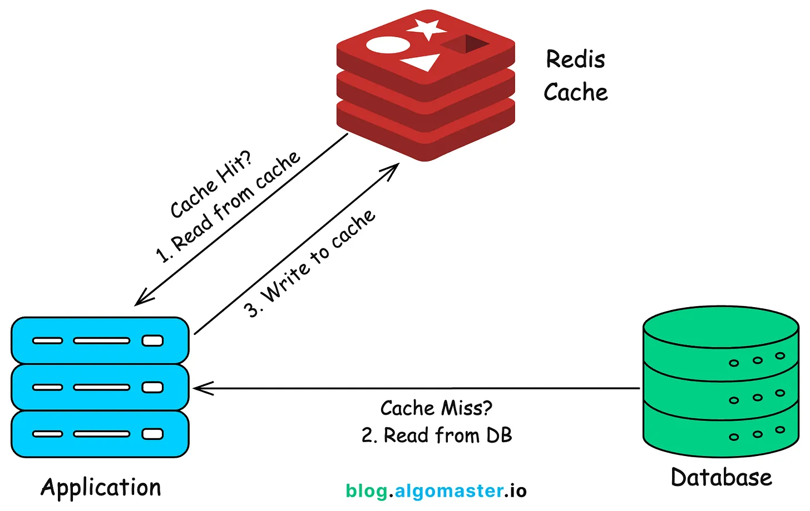
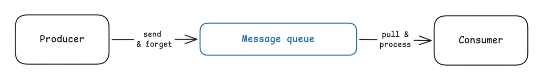

# System-Design

## NodeJs

Node is single-threaded and handles concurrent requests. Every HTTP request, when it has work to do, is just a callback/function sitting in a queue. 



### Flow

Example with 3 concurrent HTTP requests

```
t=0ms  → Req A arrives
         thread runs Req A JS...
         hits await db.query()  → DB call sent to OS
         Req A SUSPENDS (saved in memory as a closure)
         thread is FREE ↓

t=1ms  → Req B arrives
         thread runs Req B JS...
         hits await fetch()  → HTTP call sent to OS
         Req B SUSPENDS
         thread is FREE ↓

t=2ms  → Req C arrives
         thread runs Req C JS...
         no async calls!
         response sent ✅
         thread is FREE ↓

t=800ms → fetch() for Req B resolves
          OS notifies libuv → puts "resume Req B" in queue
          thread picks it up, finishes Req B JS
          response sent ✅

t=2s  → db.query() for Req A resolves
          OS notifies libuv → puts "resume Req A" in queue
          thread picks it up, finishes Req A JS
          response sent ✅
````


### Where this matters in practice for API servers:

#### CPU-intensive work:

- Event loop (NodeJs) → one request doing heavy math (sync work) blocks ALL other requests
- Thread pool (.NET) → one request doing heavy math (sync work) uses Thread 1, Thread 2 still serves others

#### High I/O, light CPU (typical REST API):

- Event loop (NodeJs)  → excels, very low overhead, handles thousands of concurrent connections
- Thread pool (.NET)  → also great (especially with async/await), but more memory usage

For a typical REST API, modern .NET with async/await behaves very similarly to Node for I/O-bound work — when you await a DB call, .NET also frees the thread back to the pool. So for typical web APIs, the practical difference is smaller than people think.

## Redis

We will explain Redis simple only in-memory use case.
But you can configure with persistence: RDB (Redis Database Snapshot) and AOF (Append Only File)

## Redis internally

### RAM

Data in Redis lives in RAM. It loses data when the server shuts down or crashes



### EventLoop 



Redis receives multiple requests/commands. Commands are executed sequentially. One request/command at a time is processed synchronously by the event loop in a single-threaded manner. Each command is executed synchronously. command run for few microseconds, milliseconds or nanoseconds depending on the operation. After finished, then back to event loop to run next command from next request/client. No other thread executes Redis commands concurrently. So, no race conditions inside Redis data structures.

### Data structures



### Example

Caching



## Message Queues

A Message Queue is a way for different parts of a system to communicate asynchronously by sending messages through a queue instead of talking directly.

- Async Work → work is executed asynchronously via messages, not direct calls
- Decoupling → services don’t depend on each other directly
- Reliability → messages can be stored until processed (don't lose work)
- Load smoothing → handles traffic spikes without crashing systems
- Independent scaling → producers and consumers can scale separately
- Consumer pacing → consumers read and process messages at their own speed



### Message delivery guarantees in distributed systems

| Guarantee     | Duplicates | Loss Possible | Typical Use Case            |
| ------------- | ---------- | ------------- | --------------------------- |
| At most once  | ❌ No       | ✅ Yes         | Logs, metrics               |
| At least once | ✅ Yes      | ❌ No          | Payments (with idempotency) |
| Exactly once  | ❌ No       | ❌ No          | Financial transactions      |

For at-least-once delivery, consumers should be idempotent. consumers must handle repeated messages safely, producing the same result even if the message is processed multiple times.

“exactly once” (No duplicates, no loss) is very hard to achieve in distributed systems. 
In RabbitMQ, depends on application-level guarantees (e.g., idempotency, unique constraints), not the broker itself.

### Durable queues

Both Apache Kafka and RabbitMQ support persisted (durable) queues. RabbitMQ persist messages until they are consumed and ACKed. Kafka persist all events for a configured retention period, regardless of consumption.

### Kafka vs RabbitMQ

RabbitMQ is designed for task-oriented workflows, smart routing, where the broker directs messages based on content, moderate scale and need low latency, prioritize simplicity, and messages are ephemeral. Examples: sending emails, processing payments, resizing images.

Kafka is built for data durability, need multiple systems to read the same event stream independently, messages persist to allow for independent processing and historical replay, massive scale (millions of events per second). Examples: analytics, fraud detection, or audit logs.

Pro-tip: Many complex architectures use both—utilizing Kafka as the durable event backbone and RabbitMQ for the specific background jobs triggered by those events

### RabbitMQ (Smart Broker)

Operates as a “smart broker” with “simple consumers.” The broker is responsible for managing complex tasks such as routing rules, tracking message deliveries, and handling retries. it can route messages to a Dead Letter Queue (DLQ) based on TTL expiration, rejection with requeue=false, or max delivery attempts via policies. A message is removed from the queue only after it is acknowledged (ACK) by the consumer. If a consumer fails (crashes or disconnects) before sending an ACK, the message is requeued and can be delivered again.

#### RabbitMQ (queue-based model)

- A consumer receives a message, and that message becomes “in-flight” (i.e., delivered but not yet acknowledged). Other consumers cannot see or process it.
- If the consumer processes the message and sends an ACK, the message is permanently removed from the queue.
- If the consumer fails (crashes, disconnects, or does not ACK), RabbitMQ requeues the message, making it available again for the same or another consumer to process.

#### Message Ordering

- Strict Ordering: RabbitMQ maintains strict order, meaning messages are delivered to consumers in the exact sequence they were received by the broker.
- Single Consumer Guarantee: If you use a single consumer, you are guaranteed perfect, sequential ordering of all messages.
- Parallelism Trade-off: While you can increase throughput by adding multiple consumers, doing so allows them to process messages in parallel, which trades off that strict global ordering for speed.

### Kafka (Simple Broker)

Operates as a “simple broker” with “smart consumers.” The broker focuses on storing messages in an ordered, append-only log, while consumers are responsible for tracking their own progress (offsets) and deciding when to read data. Messages are not deleted after being consumed; they are retained based on time or size retention policies. Each consumer (or consumer group) tracks its own offset, allowing multiple consumers to read the same data independently. Within a consumer group, each partition is consumed by only one consumer at a time, ensuring ordering per partition. Consumers control when to commit offsets, which determines replay behavior (e.g., reprocessing messages). The broker does not manage retries or DLQs by default — these are typically handled at the application level (or via additional patterns/tools). Designed for high-throughput data streaming, making it ideal for analytics and aggregation workloads (e.g., event streaming, metrics pipelines, log processing). Supports stream processing frameworks to perform real-time aggregation, transformations, and windowed computations on data streams.

#### Kafka (log-based model)

- Multiple consumers can read the same message independently.
- Each consumer (or consumer group) tracks its own position (offset) in the log.
- A consumer reads a message at offset X, processes it, and then commits offset X + 1.
- If the consumer fails (crashes or disconnects) before committing, the offset remains at X, so the same message will be read again after recovery.

#### Message Ordering

- Ordering within a partition: Kafka guarantees that messages are stored and processed in the correct order only within their specific partition.
- The role of partition keys: You determine which partition a message is sent to by assigning it a partition key. For example, all orders from a specific customer can be routed to the same partition, ensuring those specific events remain in sequence.
- The trade-off: While Kafka does not guarantee global ordering across different partitions, this design allows for parallelism, enabling massive throughput that wouldn't be possible with a single, strictly ordered queue.

## References:

- Youtube channel - TechWorld with Nana
- Youtube channel - Hello Interview - SWE Interview Preparation
- Blog - algomaster